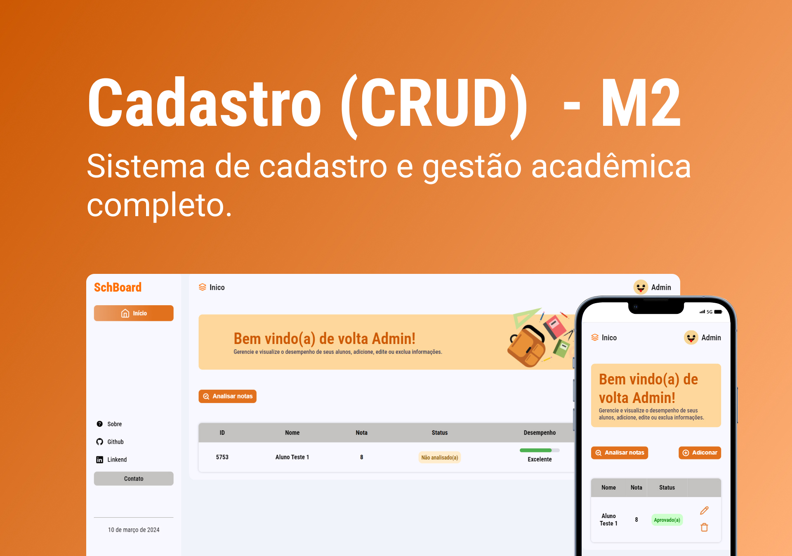

<h1 align="center"> Mini Projeto #02 - CRUD </h1>

Projeto desenvolvido para o módulo 02, do curso Programadores do Amanhã.  

  <a href="#tecnologias">Tecnologias</a>&nbsp;&nbsp;&nbsp;|&nbsp;&nbsp;&nbsp;
  <a href="#informações">Informações</a>&nbsp;&nbsp;&nbsp;|&nbsp;&nbsp;&nbsp;
  <a href="#projeto">Projeto</a>&nbsp;&nbsp;&nbsp;|&nbsp;&nbsp;&nbsp;
  <a href="#memo-licença">Licença</a>

  

 

  

<h2 id="tecnologias"></h2>

## 🚀 Tecnologias 

Este projeto foi desenvolvido com:

- HTML, CSS e JavaScript
- JavaScript específico (Classes, DOM, Array, Object e localStorage)
- Git e GitHub
- Figma

<h2 id="informações"></h2>

## 📌 Informações

- Este projeto tem como objetivo a criação de um sistema de cadastro de alunos, abrangendo suas informações pessoais e notas acadêmicas. O sistema permite a adição, edição, visualização e exclusão de alunos, além de fornecer a possibilidade de verificar o desempenho acadêmico individual de cada aluno.

<h2 id="projeto"></h2>

## 💻 Projeto

Projeto CRUD (Create, Read, Update e Delete) desenvolvido para o 02# mini projeto proposto pela organização Programadores do Amanhã, utilizando HTML, CSS e JavaScript.

- [Visite o projeto online](https://reury-cardoso.github.io/projeto-pda-cadastro/)

## Autor

[Reury](https://github.com/reury-cardoso)

## :memo: Licença

Este projeto é licenciado sob a Licença [MIT]